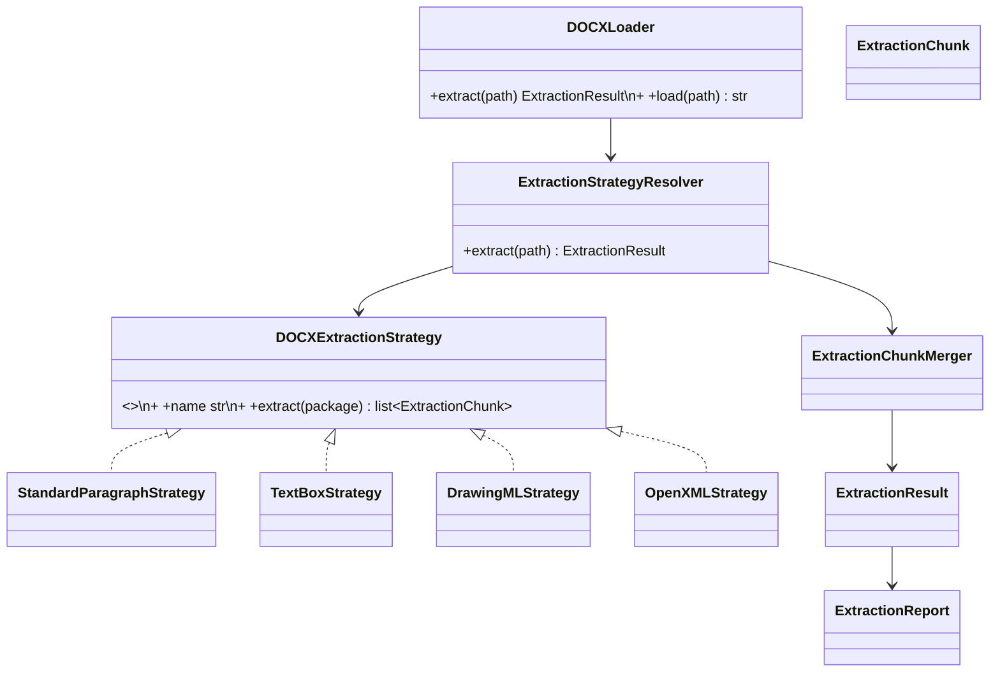

# DOCX Extraction Architecture Proposal

## Goal

Replace paragraph-only DOCX extraction with a source-aware OpenXML extraction engine. The new engine preserves the existing CV pipeline and exposes a richer diagnostic contract for callers that need it.

## Design

`DOCXLoader` is an adapter: `extract()` returns the new typed contract and `load()` remains a backward-compatible convenience method returning `result.raw_text`. `ExtractionService` consumes `extract()` but still provides the exact same `CVDocument` output to the mission and API layers.

## Responsibilities

| Component | Single responsibility |
| --- | --- |
| `StandardParagraphStrategy` | Extract normal paragraphs and table-cell text exposed by `python-docx`. |
| `TextBoxStrategy` | Extract paragraph-preserved text from `w:txbxContent` containers. |
| `DrawingMLStrategy` | Extract text from DrawingML `a:txBody` containers that is not already textbox content. |
| `OpenXMLStrategy` | Recover ordinary WordprocessingML text from the main story and headers/footers when higher-level traversal misses it. |
| `ExtractionChunk` | Carry text, source, package part, and ordering metadata. |
| `ExtractionChunkMerger` | Normalize, de-duplicate, order, and join chunks. It contains no XML parsing. |
| `ExtractionStrategyResolver` | Own strategy ordering, package validation, error isolation, report construction, and unsupported/image-only classification. |
| `ExtractionReport` | Explain sources attempted, sources that contributed text, failures, warnings, document signals, and terminal status. |

Strategies share a read-only OpenXML package context, but never call one another. Their outputs are values, making each strategy independently unit testable. XML namespace and paragraph extraction helpers live in one shared OpenXML support module, preventing duplicated parsing logic.

## Flow

The resolver runs all applicable strategies so the result covers mixed-layout documents. The merger protects the downstream contract from repeated text that is reachable through both high-level and package-level views.

## Classification and reporting

Success is not equivalent to “no exception”. The report distinguishes `success`, `empty`, `image_only`, `unsupported`, and `failed`. It lists attempted strategies, contributions, warnings, errors, text-node and image counts, and layout signals. Canva, Google Docs, and Word templates are treated as DOCX layout variants rather than unreliable producer signatures. OCR remains a future optional escalation, never the primary extractor.

## SOLID and migration

SRP is maintained through focused strategies; OCP through strategy registration; DIP through the `DOCXExtractionStrategy` protocol; and interface segregation through small immutable value objects. Implement the models and resolver, adapt `DOCXLoader` and `ExtractionService` while preserving `load() -> str`, add strategy and corpus tests, and remove temporary audit prints. PDF behavior and all mission, builder, profile, API, and Flutter contracts remain unchanged.
