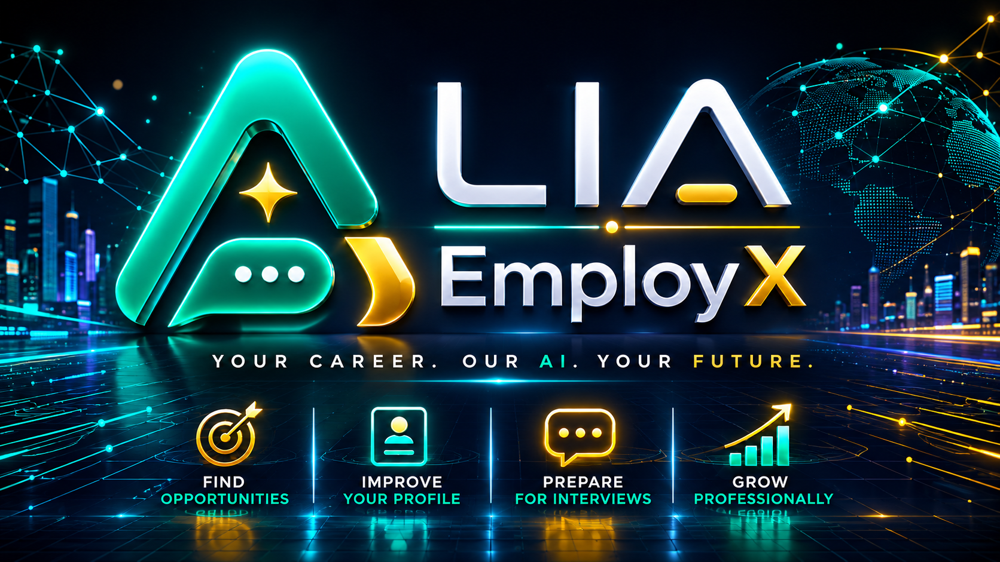

# 🚀 The AI Career Operating System

<p align="center">
  
</p>

<p align="center">
  <strong>Your Career. Our AI. Your Future.</strong>
</p>

LIA-EmployX is a next-generation AI platform that transforms job searching into an autonomous, intelligent workflow.

Instead of relying on a single chatbot, LIA-EmployX coordinates a team of specialized AI Agents that continuously collaborate to optimize your professional profile, discover opportunities, improve your resume, prepare interviews, and guide your career strategy.

The goal is simple:

> **Your Career. Our AI. Your Future.**

---

# ✨ Vision

The future of Artificial Intelligence is not one assistant.

The future belongs to teams of specialized AI Agents working together.

LIA-EmployX is building the world's first **AI Career Operating System**, where every agent has a specialized mission while collaborating with the entire team to achieve one objective:

**Helping professionals land their ideal job faster than ever before.**

---

# 🧠 Core AI Agents

## 🟢 Career Agent IA

Your executive AI coordinator.

### Responsibilities

- Career strategy
- Professional roadmap
- Skills gap analysis
- Learning recommendations
- Career planning
- Mission coordination

---

## 🔵 CV Expert Agent

Your resume optimization specialist.

### Responsibilities

- ATS Optimization
- Resume rewriting
- Resume scoring
- Keyword enhancement
- Professional formatting
- AI Resume Analysis

---

## 🟠 Job Hunter Agent

Your autonomous recruiter.

### Responsibilities

- Job discovery
- Company matching
- Salary analysis
- Remote opportunities
- International opportunities
- Intelligent recommendations

---

# 🚀 Upcoming AI Agents

| Agent | Purpose |
|---|---|
| 🎤 Interview Coach | AI interview simulator |
| 💰 Salary Negotiator | Salary negotiation assistant |
| 🌍 Visa Advisor | Immigration & relocation |
| 🤝 LinkedIn Networker | Networking automation |
| ✉ Cover Letter Generator | Personalized cover letters |
| 📈 Market Analyst | Job market intelligence |
| 📧 Email Assistant | Recruiter communication |
| 📱 WhatsApp Assistant | Automated follow-ups |
| 🌎 Remote Hunter | Worldwide remote jobs |
| ⚖ Legal Advisor | Employment documentation |

---

# 🖥️ Main Features

- Multi-Agent AI Architecture
- Mission Center
- AI Marketplace
- Resume Analyzer
- ATS Optimization
- Resume Generator
- Job Matching
- Cover Letter Generator
- Interview Preparation
- Career Dashboard
- Professional Analytics
- Local LLM Support
- NVIDIA NIM Integration (planned)

---

# 🏗️ System Architecture

```text
                    Mission Center
                           │
        ┌──────────────────┼──────────────────┐
        │                  │                  │
        ▼                  ▼                  ▼

 Career Agent IA     CV Expert Agent     Job Hunter Agent

        │                  │                  │

        └──────────── AI Event Bus ───────────┘

                    Agent Coordinator

                           │

                  Local AI Models
                     NVIDIA NIM
                    FastAPI Backend
