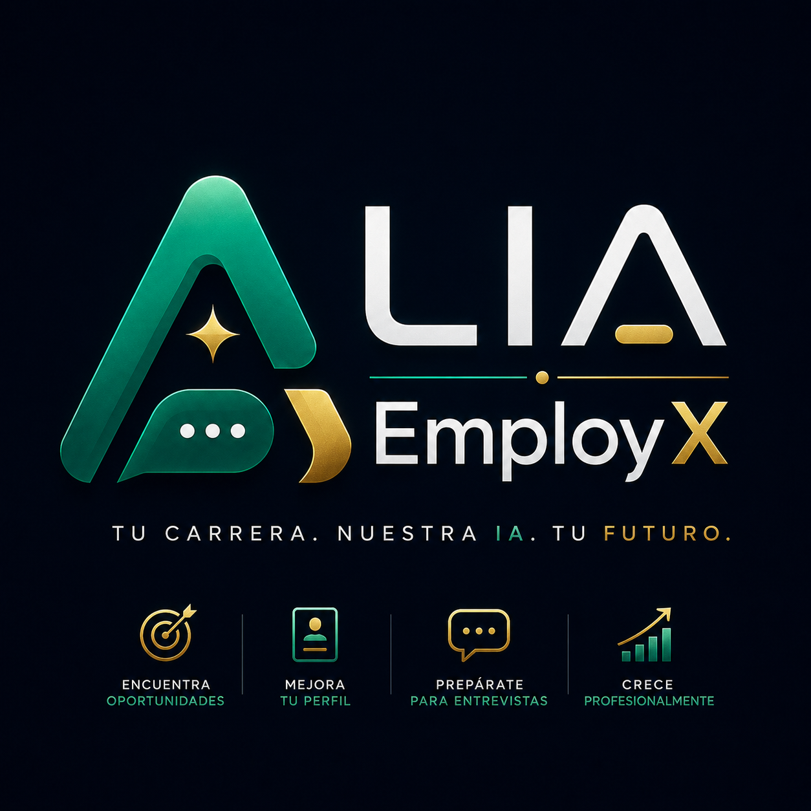

<p align="center">
  
</p>

<h1 align="center">
LIA-EmployX
</h1>

<p align="center">
<b>The AI Career Operating System</b>
</p>

<p align="center">
Autonomous AI Agents working together to help you land your ideal job.
</p>

<p align="center">


</p>

---

# 🚀 The AI Career Operating System

LIA-EmployX is a next-generation AI platform that transforms job searching into an autonomous, intelligent workflow.

Instead of relying on a single chatbot, LIA-EmployX coordinates a team of specialized AI Agents that continuously collaborate to optimize your professional profile, discover opportunities, improve your resume, prepare interviews, and guide your career strategy.

The goal is simple:

> **Your Career. Our AI. Your Future.**

---

# ✨ Vision

The future of Artificial Intelligence is not one assistant.

The future belongs to teams of specialized AI Agents working together.

LIA-EmployX is building the world's first **AI Career Operating System**, where every agent has a specialized mission while collaborating with the entire team to achieve one objective:

**Helping professionals land their ideal job faster than ever before.**

---

# 🧠 Core AI Agents

## 🟢 Career Agent IA

Your executive AI coordinator.

### Responsibilities

- Career strategy
- Professional roadmap
- Skills gap analysis
- Learning recommendations
- Career planning
- Mission coordination

---

## 🔵 CV Expert Agent

Your resume optimization specialist.

### Responsibilities

- ATS Optimization
- Resume rewriting
- Resume scoring
- Keyword enhancement
- Professional formatting
- AI Resume Analysis

---

## 🟠 Job Hunter Agent

Your autonomous recruiter.

### Responsibilities

- Job discovery
- Company matching
- Salary analysis
- Remote opportunities
- International opportunities
- Intelligent recommendations

---

# 🚀 Upcoming AI Agents

| Agent | Purpose |
|--------|----------|
| 🎤 Interview Coach | AI interview simulator |
| 💰 Salary Negotiator | Salary negotiation assistant |
| 🌍 Visa Advisor | Immigration & relocation |
| 🤝 LinkedIn Networker | Networking automation |
| ✉ Cover Letter Generator | Personalized cover letters |
| 📈 Market Analyst | Job market intelligence |
| 📧 Email Assistant | Recruiter communication |
| 📱 WhatsApp Assistant | Automated follow-ups |
| 🌎 Remote Hunter | Worldwide remote jobs |
| ⚖ Legal Advisor | Employment documentation |

---

# 🖥️ Main Features

- Multi-Agent AI Architecture
- Mission Center
- AI Marketplace
- Resume Analyzer
- ATS Optimization
- Resume Generator
- Job Matching
- Cover Letter Generator
- Interview Preparation
- Career Dashboard
- Professional Analytics
- Local LLM Support
- NVIDIA NIM Integration (planned)

---

# 🏗️ System Architecture

```
                    Mission Center
                           │
        ┌──────────────────┼──────────────────┐
        │                  │                  │
        ▼                  ▼                  ▼

 Career Agent IA     CV Expert Agent     Job Hunter Agent

        │                  │                  │

        └──────────── AI Event Bus ───────────┘

                    Agent Coordinator

                           │

                  Local AI Models
                     NVIDIA NIM
                    FastAPI Backend
```

---

# 🎯 Mission Center

Unlike traditional AI assistants, LIA-EmployX allows multiple AI Agents to collaborate simultaneously.

Each agent continuously executes specialized tasks while reporting progress to the Mission Center.

Examples:

- Improve ATS Score
- Detect missing skills
- Search remote jobs
- Analyze salaries
- Rewrite resume
- Prepare interviews
- Generate Cover Letters

---

# 🛒 AI Marketplace

Expand your AI team by installing specialized agents.

Examples:

- Interview Coach
- Visa Advisor
- LinkedIn Networker
- Salary Negotiator
- Remote Hunter
- Email Assistant
- WhatsApp Assistant
- Market Analyst

Every agent extends the capabilities of the operating system.

---

# 🛠️ Technology Stack

## Frontend

- Flutter
- Material 3
- Desktop-first UI
- Glassmorphism
- Custom Design System

## Backend

- Python
- FastAPI
- SQLite
- Modular Architecture

## Artificial Intelligence

- Multi-Agent System
- Local LLM Support
- NVIDIA NIM
- Event Bus Architecture
- Autonomous AI Coordination

---

# 🎨 UI / UX Philosophy

LIA-EmployX is inspired by modern premium software including:

- Linear
- Cursor
- Raycast
- Notion
- Arc Browser

The objective is to create software that feels less like an application...

…and more like an intelligent operating system.

---

# 📸 Preview

> Screenshots coming soon.

Future sections will showcase:

- Home Command Center
- Mission Center
- AI Marketplace
- AI Team Dashboard
- Resume Analyzer
- Job Search Dashboard

---

# 🗺️ Development Roadmap

## Phase 1

- ✅ Design System
- ✅ Desktop UI
- ✅ AI Marketplace
- ✅ Mission Center
- ✅ Core AI Agents
- ✅ Multi-Agent Architecture

## Phase 2

- 🚧 Resume Parser
- 🚧 ATS Optimization Engine
- 🚧 Job Matching Engine
- 🚧 Interview Simulator
- 🚧 Career Analytics

## Phase 3

- ⏳ NVIDIA NIM Integration
- ⏳ Local LLM Runtime
- ⏳ Email Automation
- ⏳ LinkedIn Automation
- ⏳ WhatsApp Automation
- ⏳ Cloud Synchronization

---

# 🤝 Contributing

Contributions, ideas, bug reports and feature requests are always welcome.

If you'd like to help build the future of AI-powered career development, feel free to open an Issue or submit a Pull Request.

---

# 📄 License

Licensed under the MIT License.

---

<p align="center">

# LIA-EmployX

### The AI Career Operating System

### Your Career. Our AI. Your Future.

</p>

---

<p align="center">
Made with ❤️ using Flutter, Python and Artificial Intelligence.
</p>

<p align="center">
© 2026 LIA Project. All rights reserved.
</p>
